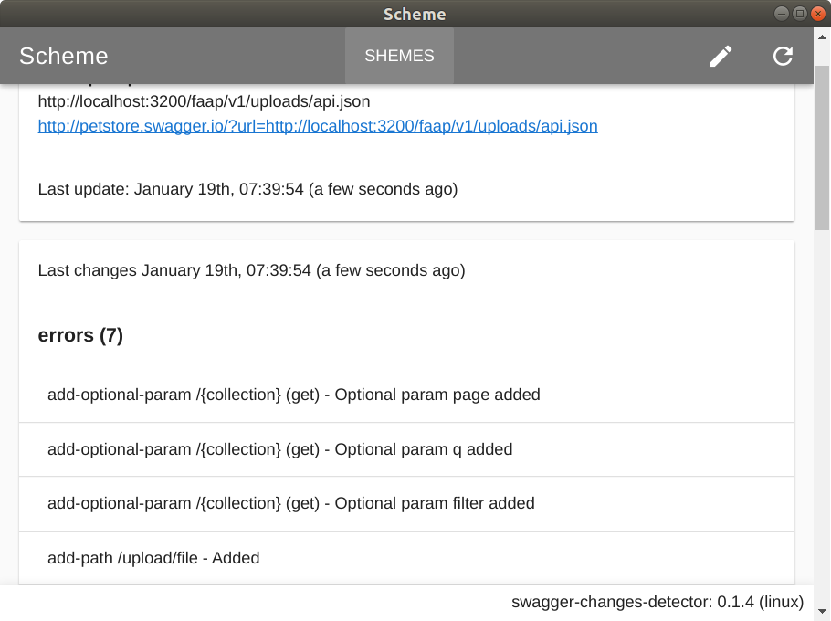

# swagger-changes-detector

[](https://travis-ci.org/grinat/swagger-changes-detector)
[](https://ci.appveyor.com/project/grinat/swagger-changes-detector)

Detect and compares changes in swagger 2.0 json scheme



#### Download

[Windows](https://github.com/grinat/swagger-changes-detector/releases/latest)

[Linux](https://github.com/grinat/swagger-changes-detector/releases/latest)

[Mac OS](https://github.com/grinat/swagger-changes-detector/releases/latest)

#### Build Setup

``` bash
# install dependencies
npm install

# serve with hot reload at localhost:9080
npm run dev

# build electron application for production
npm run build

# run unit & end-to-end tests
npm test


```

---

This project was generated with [electron-vue](https://github.com/SimulatedGREG/electron-vue)@[7c4e3e9](https://github.com/SimulatedGREG/electron-vue/tree/7c4e3e90a772bd4c27d2dd4790f61f09bae0fcef) using [vue-cli](https://github.com/vuejs/vue-cli). Documentation about the original structure can be found [here](https://simulatedgreg.gitbooks.io/electron-vue/content/index.html).
